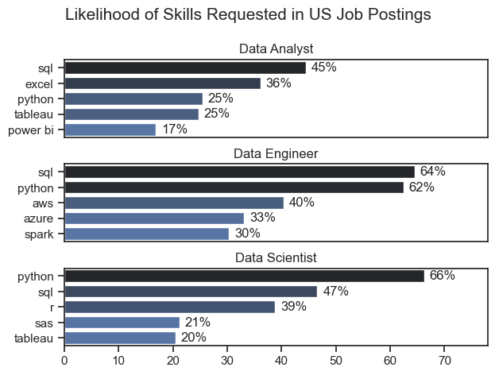
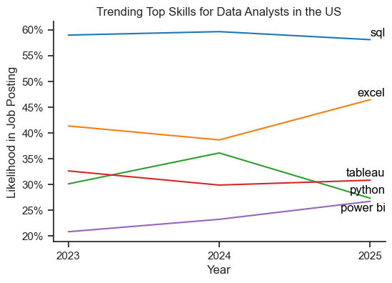
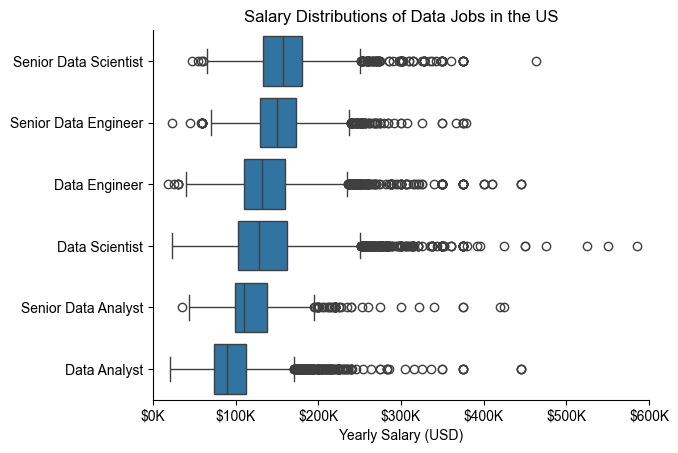
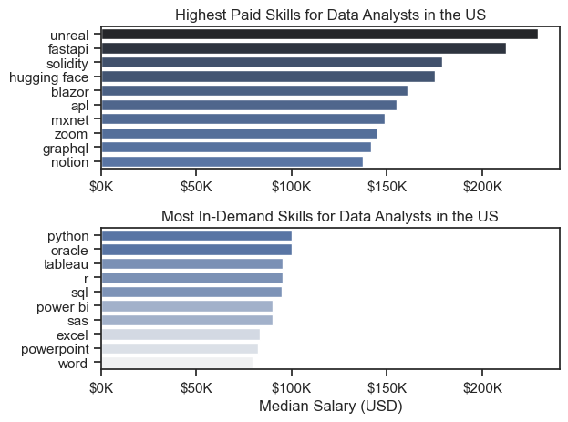
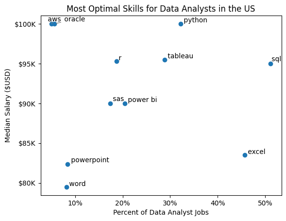
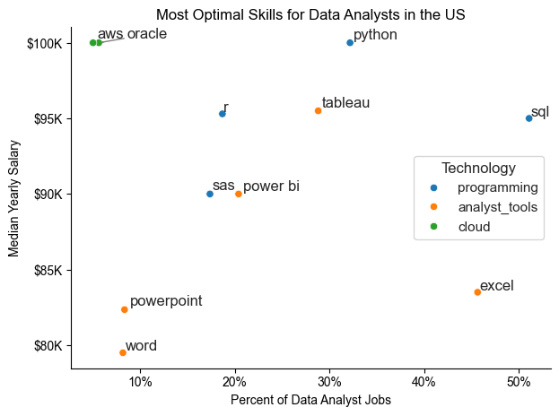

# Overview

Welcome to my analysis of the data job market, focusing on data analyst roles. This project was created out of a desire to navigate and understand the job market more effectively. It delves into the top-paying and in-demand skills to help find optimal job opportunities for data analysts.

Through a series of Python scripts, I explore key questions such as the most demanded skills, salary trends, and the intersection of demand and salary in data analytics.

# The Questions

Below are the questions I want to answer in my project:

1. What are the skills most in demand for the top 3 most popular data roles?
2. How are in-demand skills trending for Data Analysts?
3. How well do jobs and skills pay for Data Analysts?
4. What are the optimal skills for data analysts to learn? (High Demand AND High Paying) 

# Tools I Used

For my deep dive into the data analyst job market, I harnessed the power of several key tools:

- **Python:** The backbone of my analysis, allowing me to analyze the data and find critical insights.I also used the following Python libraries:
    - **Pandas Library:** This was used to analyze the data. 
    - **Matplotlib Library:** I visualized the data.
    - **Seaborn Library:** Helped me create more advanced visuals. 
- **Jupyter Notebooks:** The tool I used to run my Python scripts which let me easily include my notes and analysis.
- **Visual Studio Code:** My go-to for executing my Python scripts.
- **Git & GitHub:** Essential for version control and sharing my Python code and analysis, ensuring collaboration and project tracking.

# Data Preparation and Cleanup

This section outlines the steps taken to prepare the data for analysis, ensuring accuracy and usability.

## Import & Clean Up Data

I start by importing necessary libraries and loading the dataset, followed by initial data cleaning tasks to ensure data quality.

```python
# Importing Libraries
import ast
import pandas as pd
import seaborn as sns
import matplotlib.pyplot as plt  

df = pd.read_csv("../Data/job_postings_flat.csv")

# Data Cleanup
df['job_posted_date'] = pd.to_datetime(df['job_posted_date'])
df['job_skills'] = df['job_skills'].apply(lambda x: ast.literal_eval(x) if pd.notna(x) else x)
```

## Filter US Jobs

To focus my analysis on the U.S. job market, I apply filters to the dataset, narrowing down to roles based in the United States.

```python
df_US = df[df['job_country'] == 'United States']

```

# The Analysis

Each Jupyter notebook for this project aimed at investigating specific aspects of the data job market. Here’s how I approached each question:

## 1. What are the most demanded skills for the top 3 most popular data roles?

To find the most demanded skills for the top 3 most popular data roles. I filtered out those positions by which ones were the most popular, and got the top 5 skills for these top 3 roles. This query highlights the most popular job titles and their top skills, showing which skills I should pay attention to depending on the role I'm targeting. 

View my notebook with detailed steps here: [2_Skill_Demand](Project/2_Skill_Demand.ipynb).

### Visualize Data

```python
fig, ax = plt.subplots(len(job_titles), 1)


for i, job_title in enumerate(job_titles):
    df_plot = df_skills_perc[df_skills_perc['job_title_short'] == job_title].head(5)
    sns.barplot(data=df_plot, x='skill_percent', y='job_skills', ax=ax[i], hue='skill_count', palette='dark:b_r')

plt.show()
```

### Results



*Bar graph visualizing the salary for the top 3 data roles and their top 5 skills associated with each.*

### Insights:

- SQL is the most requested skill for Data Analysts and Data Scientists, with it in over half the job postings for both roles. For Data Engineers, Python is the most sought-after skill, appearing in 66% of job postings.
- Data Engineers require more specialized technical skills (AWS, Azure, Spark) compared to Data Analysts and Data Scientists who are expected to be proficient in more general data management and analysis tools (Excel, Tableau).
- Python is a versatile skill, highly demanded across all three roles, but most prominently for Data Scientists (66%) and Data Engineers (62%).

## 2. How are in-demand skills trending for Data Analysts?

To find how skills are trending over 3 year time period for Data Analysts, I filtered data analyst positions and grouped the skills by the year of the job postings. This got me the top 5 skills of data analysts by year, showing how popular skills were throughout 2023-2025.

View my notebook with detailed steps here: [3_Skills_Trend](Project/3_Skills_Trend.ipynb).

### Visualize Data

```python

from matplotlib.ticker import PercentFormatter
from adjustText import adjust_text

fig, ax = plt.subplots(figsize=(6, 4))

df_plot = df_DA_US_percent.iloc[:, :5]
sns.lineplot(data=df_plot, dashes=False, legend='full', palette='tab10', ax=ax)
sns.set_theme(style='ticks')
sns.despine(ax=ax) # remove top and right spines

years = df_plot.index.astype(int).to_list()
ax.set_xticks(years)
ax.set_xticklabels(years)

ax.set_title('Trending Top Skills for Data Analysts in the US')
ax.set_ylabel('Likelihood in Job Posting')
ax.set_xlabel('Year')
ax.legend_.remove()
ax.yaxis.set_major_formatter(PercentFormatter(decimals=0))

# annotate the plot with the top 5 skills using plt.text()
texts = []
for i in range(5):
    texts.append(ax.text(2025.1, df_plot.iloc[-1, i], df_plot.columns[i], color='black'))
adjust_text(texts, arrowprops=dict(arrowstyle="->", color='grey', lw=1))

plt.show()

```

### Results

  
*Bar graph visualizing the trending top skills for data analysts in the US from 2023 to 2025.*

### Insights:
- SQL stays the #1 requirement and is essentially flat (~58–60%) across 2023–2025.
- Excel is surging: after a dip in 2024, it jumps to the mid-40%s in 2025, widening its lead over the other non-SQL skills.
- Tool preferences are shifting: Power BI steadily rises each year, while Python peaks in 2024 then drops sharply by 2025 (Tableau stays roughly flat around ~30%).

## 3. How well do jobs and skills pay for Data Analysts?

To identify the highest-paying roles and skills, I only got jobs in the United States and looked at their median salary. But first I looked at the salary distributions of common data jobs like Data Scientist, Data Engineer, and Data Analyst, to get an idea of which jobs are paid the most. 

View my notebook with detailed steps here: [4_Salary_Analysis](Project/4_Salary_Analysis.ipynb).

#### Visualize Data 

```python
sns.boxplot(data=df_US_top6, x='salary_year_avg', y='job_title_short', order=job_order)

ticks_x = plt.FuncFormatter(lambda y, pos: f'${int(y/1000)}K')
plt.gca().xaxis.set_major_formatter(ticks_x)
plt.show()

```

#### Results

  
*Box plot visualizing the salary distributions for the top 6 data job titles.*

#### Insights

- There's a significant variation in salary ranges across different job titles. Senior Data Scientist positions tend to have the highest salary potential, with up to $500K, indicating the high value placed on advanced data skills and experience in the industry.

- Senior Data Engineer and Senior Data Scientist roles show a considerable number of outliers on the higher end of the salary spectrum, suggesting that exceptional skills or circumstances can lead to high pay in these roles. In contrast, Data Analyst roles demonstrate more consistency in salary, with fewer outliers.

- The median salaries increase with the seniority and specialization of the roles. Senior roles (Senior Data Scientist, Senior Data Engineer) not only have higher median salaries but also larger differences in typical salaries, reflecting greater variance in compensation as responsibilities increase.

### Highest Paid & Most Demanded Skills for Data Analysts

Next, I narrowed my analysis and focused only on data analyst roles. I looked at the highest-paid skills and the most in-demand skills. I used two bar charts to showcase these.

#### Visualize Data

```python

fig, ax = plt.subplots(2, 1)  

# Top 10 Highest Paid Skills for Data Analysts
sns.barplot(data=df_DA_top_pay, x='median', y=df_DA_top_pay.index, hue='median', ax=ax[0], palette='dark:b_r')

# Top 10 Most In-Demand Skills for Data Analystsr')
sns.barplot(data=df_DA_skills, x='median', y=df_DA_skills.index, hue='median', ax=ax[1], palette='light:b')

plt.show()

```

#### Results
Here's the breakdown of the highest-paid & most in-demand skills for data analysts in the US:


*Two separate bar graphs visualizing the highest paid skills and most in-demand skills for data analysts in the US.*

#### Insights:

- Pay premium comes from niche/engineering-adjacent skills: Unreal, FastAPI, Solidity, Hugging Face top the highest-paid list (roughly ~$170K–$230K+), far above typical analytics-tool pay.

- “Most in-demand” is dominated by core analytics stack: Python, SQL, Tableau, R, Power BI (about ~$90K–$100K median) — steady demand, but lower salary ceiling than the niche skills.

- Little overlap between the lists: what’s most requested (Python/SQL/BI tools) isn’t what’s most lucrative (specialized frameworks/platforms), suggesting specialization is what drives top-end compensation.

## 4. What are the most optimal skills to learn for Data Analysts?

To identify the most optimal skills to learn ( the ones that are the highest paid and highest in demand) I calculated the percent of skill demand and the median salary of these skills. To easily identify which are the most optimal skills to learn. 

View my notebook with detailed steps here: [5_Optimal_Skills](Project/5_Optimal_Skills.ipynb).

#### Visualize Data

```python
from adjustText import adjust_text
import matplotlib.pyplot as plt

plt.scatter(df_DA_skills_high_demand['skill_percent'], df_DA_skills_high_demand['median_salary'])
plt.show()

```

#### Results

    
*A scatter plot visualizing the most optimal skills (high paying & high demand) for data analysts in the US.*

#### Insights:

- Best “bang for buck” core skills: SQL (~50%+ of roles, ~$95K) and Python (~33%, ~$100K) combine high demand with top-tier pay; Tableau (~30%, ~$95K) is also strong.

- High-pay, low-coverage specialties: AWS and Oracle sit near ~$100K but appear in <10% of roles—useful differentiators, not universal requirements.

- High demand ≠ high salary: Excel shows very high coverage (~45%) but lower median pay (~$83–84K); basic office tools (Word/PowerPoint) are lowest-paid.

### Visualizing Different Techonologies

Let's visualize the different technologies as well in the graph. I'll add color labels based on the technology (e.g., {Programming: Python})

#### Visualize Data

```python
from matplotlib.ticker import PercentFormatter

# Create a scatter plot
scatter = sns.scatterplot(
    data=df_DA_skills_tech_high_demand,
    x='skill_percent',
    y='median_salary',
    hue='technology',  # Color by technology
    palette='bright',  # Use a bright palette for distinct colors
    legend='full'  # Ensure the legend is shown
)
plt.show()

```

#### Results

  
*A scatter plot visualizing the most optimal skills (high paying & high demand) for data analysts in the US with color labels for technology.*

#### Insights:

- Programming skills sit highest on the pay–demand curve: Python (~33%, ~$100K) and SQL (~50%+, ~$95K) are the strongest “core” bets; R is solid but less demanded (~20%, ~$95K).

- Analyst tools split into two tiers: Tableau is a high-value tool (~30%, ~$95K), while Excel/PowerPoint/Word are widely expected but correlate with lower pay (~$80–84K).

- Cloud is a premium differentiator, not a baseline: AWS/Oracle show top pay (~$100K) but very low prevalence (<10%), suggesting they’re best as add-ons to the core stack rather than first priorities.

# What I Learned

Throughout this project, I deepened my understanding of the data analyst job market and enhanced my technical skills in Python, especially in data manipulation and visualization. Here are a few specific things I learned:

- **Advanced Python Usage**: Utilizing libraries such as Pandas for data manipulation, Seaborn and Matplotlib for data visualization, and other libraries helped me perform complex data analysis tasks more efficiently.
- **Data Cleaning Importance**: I learned that thorough data cleaning and preparation are crucial before any analysis can be conducted, ensuring the accuracy of insights derived from the data.
- **Strategic Skill Analysis**: The project emphasized the importance of aligning one's skills with market demand. Understanding the relationship between skill demand, salary, and job availability allows for more strategic career planning in the tech industry.


# Insights

This project provided several general insights into the data job market for analysts:

- **Core skills are consistent—and cross-role**: SQL and Python show up as the most requested across job postings (analyst/engineer/scientist), and they also sit in the “optimal” high-demand + high-pay zone (SQL = widest coverage, Python = top pay among core skills).
- **Highest pay often comes from specialization, not popularity**: The highest-paid skills are niche/engineering-adjacent (e.g., Unreal/FastAPI/Solidity/Hugging Face) and don’t overlap much with the most in-demand analyst skills—so the pay ceiling is driven by specialized stacks, while hiring volume is driven by core analytics tools.
- **Market is shifting toward “business tooling” while pay rises with seniority**: For analysts, Excel is trending up strongly and Power BI steadily rises, while SQL stays dominant and Python softens; meanwhile the salary distributions show clear pay jumps and wider ranges as you move from Data Analyst → (Data Scientist/Data Engineer) → senior roles.


# Challenges I Faced

This project was not without its challenges, but it provided good learning opportunities:

- **Data Inconsistencies**: Handling missing or inconsistent data entries requires careful consideration and thorough data-cleaning techniques to ensure the integrity of the analysis.
- **Complex Data Visualization**: Designing effective visual representations of complex datasets was challenging but critical for conveying insights clearly and compellingly.
- **Balancing Breadth and Depth**: Deciding how deeply to dive into each analysis while maintaining a broad overview of the data landscape required constant balancing to ensure comprehensive coverage without getting lost in details.


# Conclusion

This exploration into the data analyst job market has been incredibly informative, highlighting the critical skills and trends that shape this evolving field. The insights I got enhance my understanding and provide actionable guidance for anyone looking to advance their career in data analytics. As the market continues to change, ongoing analysis will be essential to stay ahead in data analytics. This project is a good foundation for future explorations and underscores the importance of continuous learning and adaptation in the data field.
